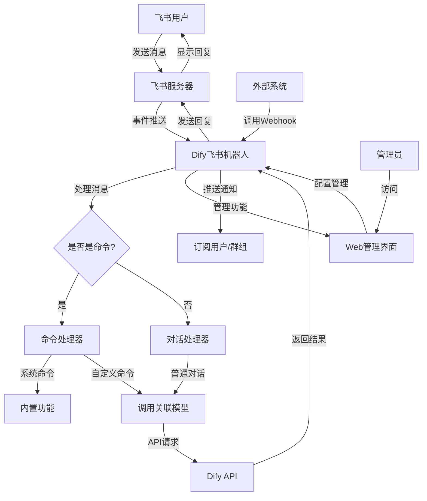

# Dify飞书机器人 - 完整使用指南

这是一个将Dify AI应用快速对接到飞书的机器人项目，支持对接不同类型的Dify应用（聊天机器人、Agent、Flow），实现在飞书中与AI应用进行交互。

## 📋 功能特点

- 🤖 支持对接Dify所有类型的应用：聊天机器人、Agent、Flow
- 💬 支持私聊和群聊（@机器人）
- 📝 支持自定义命令系统，快速调用不同功能
- 🔄 支持对话上下文保持，记忆用户历史对话
- 🚀 支持流式输出响应，实时获取AI思考过程
- 🧠 支持多模型切换，根据场景选择不同的模型
- 👥 支持多用户管理，区分管理员和普通用户
- 🌐 提供Web管理界面，方便配置和管理
- 📊 支持日志查看和会话管理
- 🔔 支持Webhook事件通知系统，实现外部系统集成
- 🔌 支持事件订阅机制，用户可选择订阅感兴趣的通知

## 🔍 架构原理



## 🚀 安装部署指南

### 前置条件

1. 已经创建好的Dify应用
2. 有飞书管理员权限，可以创建机器人
3. 公网可访问的服务器（或内网穿透服务）
4. Python 3.7+

### 步骤一：安装Dify

如果您还没有安装Dify，请按照以下步骤操作：

1. 访问 [Dify官网](https://dify.ai)，根据指南安装Dify云服务或自托管版本

2. 创建一个新的应用（聊天机器人、Agent或Flow均可）

3. 获取API密钥
   - 进入应用设置 > API访问
   - 获取并记录API密钥（API Key）
   - 记录应用端点URL

### 步骤二：创建飞书机器人

1. 登录 [飞书开发者平台](https://open.feishu.cn/app)

2. 创建自建应用
   - 点击"创建应用"
   - 填写应用名称、描述等信息
   - 上传一个机器人头像

3. 配置机器人权限
   - 在左侧菜单选择"权限管理"
   - 添加以下权限：
     - `im:message:receive_v1`（接收消息）
     - `im:message:send_v1`（发送消息）
     - `im:message.group:read`（读取群组信息，可选）
     - `im:message.p2p:read`（读取单聊信息，可选）

4. 事件订阅配置
   - 在左侧菜单选择"事件订阅"
   - 填写"请求网址"（您部署此项目的URL）
     - 例如：`https://your-domain.com/webhook/event`
   - 点击"验证"（此时可能验证失败，稍后我们会解决）
   - 添加事件：`im.message.receive_v1`（接收消息事件）

5. 获取机器人凭证
   - 在左侧菜单选择"凭证与基础信息"
   - 记录以下信息：
     - App ID
     - App Secret
     - Verification Token（事件订阅页面）

6. 发布版本
   - 提交审核并发布（内部应用可以跳过审核）

### 步骤三：部署本项目

1. 克隆代码
   ```bash
   git clone <repository-url>
   cd FeishuRBT
   ```

2. 安装依赖
   ```bash
   pip install bottle waitress
   ```

3. 配置环境变量
   ```bash
   # 飞书机器人凭证
   export VERIFICATION_TOKEN="your_verification_token"
   export APP_ID="your_app_id"
   export APP_SECRET="your_app_secret"
   export BOT_NAME="Dify机器人"  # 机器人的名称，用于识别@消息
   ```

4. 启动服务
   ```bash
   python app.py
   ```

5. 使用内网穿透工具（如果在本地开发）
   - 如Ngrok、Frp等
   - 将本地8080端口映射到公网URL
   - 复制公网URL并在飞书开发者平台"事件订阅"中更新"请求网址"

6. 完成事件订阅验证
   - 在飞书开发者平台点击"验证"按钮
   - 如果配置正确，会显示验证成功

### 步骤四：初始化并配置机器人

1. 添加机器人为好友或拉入群组

2. 初始化管理员（首次使用）
   - 私聊机器人发送 `\init-admin`
   - 收到确认消息后，您将成为管理员

3. 登录Web管理界面
   - 发送 `\admin-login` 命令
   - 点击返回的链接访问管理界面

4. 添加Dify模型
   - 在管理界面选择"模型管理" > "添加模型"
   - 填写以下信息：
     - 模型名称：自定义名称
     - 模型描述：对模型的简单描述
     - Dify API地址：Dify应用的API端点（例如：https://api.dify.ai/v1）
     - 模型类型：选择对应类型（chatbot/agent/flow）
     - API密钥：Dify应用的API Key

5. 设置默认模型
   - 在"系统配置"页面设置默认模型
   - 设置会话超时时间（默认30分钟）

### 步骤五：使用机器人

1. 基本聊天
   - 私聊：直接发送消息给机器人
   - 群聊：@机器人 + 消息内容

2. 使用命令查看帮助
   - 发送 `\help` 查看可用命令

3. 切换模型
   - 发送 `\change-model 模型名称` 切换当前会话的模型

4. 添加自定义命令（管理员）
   - 通过管理界面添加自定义命令
   - 或发送 `\command-add 名称 简介 启动指令 模型` 命令

## 🔢 可用命令列表

### 通用命令
- `\help` - 显示帮助信息
- `\model-list` - 列出所有可用模型
- `\model-info [模型名称]` - 查看指定模型详情
- `\command-list` - 列出所有可用自定义命令
- `\change-model [模型名称]` - 切换当前对话使用的模型
- `\clear` - 清除当前会话历史
- `\session-info` - 查看当前会话状态
- `\subscribe-event [配置令牌]` - 订阅指定事件通知
- `\unsubscribe-event [配置令牌]` - 取消订阅指定事件
- `\list-subscriptions` - 查看您当前的所有订阅

### 管理员命令
- `\init-admin` - 初始化管理员（仅首次使用）
- `\admin-login` - 管理员登录Web界面
- `\admin-logout` - 管理员退出Web界面
- `\admin-add [用户ID]` - 添加管理员权限
- `\admin-remove [用户ID]` - 移除管理员权限
- `\model-add [名称] [描述] [Dify地址] [类型] [密钥]` - 添加模型
- `\model-delete [名称]` - 删除模型
- `\model-update [名称] [参数] [新值]` - 更新模型参数
- `\set-default-model [名称]` - 设置默认模型
- `\set-session-timeout [分钟]` - 设置会话超时时间
- `\command-add [名称] [简介] [启动指令] [模型]` - 添加命令
- `\command-delete [名称]` - 删除命令
- `\command-update [名称] [参数] [新值]` - 更新命令
- `\webhook-list` - 查看可用的Webhook事件
- `\webhook-add [名称] [描述] [模型]` - 添加Webhook
- `\webhook-delete [ID]` - 删除Webhook
- `\webhook-status [ID] [启用/禁用]` - 修改Webhook状态

## 📊 Web管理界面

Web管理界面提供直观的方式管理机器人，包括以下功能：

- 模型管理：添加、编辑和删除模型
- 命令管理：添加、编辑和删除自定义命令
- Webhook管理：创建和管理Webhook，查看订阅情况和调用日志
- 系统配置：设置默认模型和会话超时时间
- 用户管理：查看用户并管理管理员权限
- 日志查看：查看系统日志

Web 管理界面需要管理员执行`\admin-login`，并通过响应的地址进行操作（未操作60分钟后自动失效）


## 📦 数据存储

本项目使用SQLite数据库存储配置和会话数据，包括：

- 用户信息
- 模型配置
- 自定义命令
- 会话历史
- 系统设置
- Webhook配置及订阅信息
- Webhook调用日志

数据库文件位于项目根目录下的`lark_dify_bot.db`。

## 🔌 Webhook 系统

Webhook系统允许外部应用通过HTTP请求触发机器人功能，并将结果推送给订阅用户或群组。

### Webhook功能特点

- 外部系统可以通过API调用触发AI分析
- 用户/群组可以订阅感兴趣的事件通知
- 支持自定义提示词模板处理输入数据
- 提供调用日志和统计信息

### 创建Webhook

管理员可通过以下方式创建Webhook：

1. Web管理界面
   - 进入"Webhook管理" > "添加Webhook"
   - 填写名称、描述、选择模型
   - 可选择性添加提示词模板

2. 命令方式
   ```
   \webhook-add 事件名称 事件描述 模型名称
   ```

### 订阅事件

用户可以通过以下命令订阅事件：
```
\subscribe-event 配置令牌
```

配置令牌可通过`\webhook-list`命令查看，或由管理员分享。

### 取消订阅

用户可以通过以下命令取消订阅：
```
\unsubscribe-event 配置令牌
```

### 查看订阅

用户可以查看自己当前订阅的所有事件：
```
\list-subscriptions
```

### 集成外部系统

外部系统可以通过HTTP POST请求发送数据到Webhook URL：
```
POST https://your-domain.com/api/webhook/your_token
Content-Type: application/json

{
  "data": "要分析的数据",
  "additional_info": "其他信息"
}
```

机器人会使用配置的模型分析数据，并将结果推送给所有订阅者。

### 实战示例：AWS Lambda 集成

以下是在AWS Lambda中集成Webhook的详细步骤，实现自动将日志和事件分析结果发送到飞书：

#### 1. 创建Webhook
首先，在Dify飞书机器人中创建一个名为"日志分析"的Webhook：

1. 发送命令：`\webhook-add 日志分析 "分析CloudWatch日志和报警" GPT-4分析师`
2. 或通过Web管理界面创建，设置提示词模板：
   ```
   请分析以下AWS日志或告警数据，提取关键信息：
   
   {data}
   
   请提供：
   1. 问题概述
   2. 可能原因
   3. 建议操作
   4. 严重程度评估
   ```

3. 记录生成的API Token和配置Token
4. 让运维团队成员订阅此Webhook：`\subscribe-event 配置Token`

#### 2. 创建Lambda函数

在AWS Console创建新的Lambda函数：

```python
import json
import urllib.request
import urllib.parse

# 配置Webhook URL和Token
WEBHOOK_URL = "https://your-domain.com/api/webhook/your_api_token"

def lambda_handler(event, context):
    try:
        # 提取CloudWatch事件/日志数据
        alarm_data = {}
        
        # 如果是CloudWatch告警
        if 'detail' in event and 'alarmName' in event.get('detail', {}):
            alarm_data = {
                "alarm_name": event['detail']['alarmName'],
                "state": event['detail'].get('state', {}).get('value'),
                "reason": event['detail'].get('state', {}).get('reason'),
                "timestamp": event['time'],
                "account": event['account'],
                "region": event['region']
            }
        # 如果是日志事件
        elif 'awslogs' in event:
            # 处理CloudWatch Logs
            import base64
            import zlib
            
            compressed_data = base64.b64decode(event['awslogs']['data'])
            uncompressed_data = zlib.decompress(compressed_data, 16+zlib.MAX_WBITS)
            log_data = json.loads(uncompressed_data)
            
            alarm_data = {
                "log_group": log_data.get('logGroup', ''),
                "log_stream": log_data.get('logStream', ''),
                "log_events": log_data.get('logEvents', []),
                "subscription_filters": log_data.get('subscriptionFilters', [])
            }
        else:
            # 其他事件类型
            alarm_data = event
        
        # 发送到Webhook
        headers = {
            "Content-Type": "application/json"
        }
        
        data = {
            "type": "aws_alert",
            "data": json.dumps(alarm_data, indent=2),
            "source": "aws_lambda",
            "severity": "high"
        }
        
        req = urllib.request.Request(
            WEBHOOK_URL, 
            data=json.dumps(data).encode('utf-8'),
            headers=headers,
            method="POST"
        )
        
        with urllib.request.urlopen(req) as response:
            response_body = response.read().decode('utf-8')
            print(f"Response: {response_body}")
            
        return {
            'statusCode': 200,
            'body': json.dumps('Alert sent to Feishu successfully!')
        }
        
    except Exception as e:
        print(f"Error: {str(e)}")
        return {
            'statusCode': 500,
            'body': json.dumps(f'Error: {str(e)}')
        }
```

#### 3. 配置Lambda触发器

可以从多个AWS服务配置触发器：
- CloudWatch告警
- CloudWatch Logs（通过订阅过滤器）
- EventBridge规则（捕获各种AWS事件）

例如，设置CloudWatch Logs订阅过滤器：
1. 转到CloudWatch控制台 > 日志 > 日志组
2. 选择要监控的日志组
3. 点击"操作" > "订阅过滤器" > "创建Lambda订阅过滤器"
4. 选择您创建的Lambda函数
5. 设置筛选模式，例如`ERROR`或`Exception`

#### 4. 测试集成

1. 触发一个测试事件（例如创建一个测试告警）
2. 检查Lambda函数日志确认执行成功
3. 在飞书中，订阅了"日志分析"Webhook的用户/群组应收到分析结果通知

这样，您就创建了一个自动化系统，可以实时分析AWS日志和告警，并通过Dify AI提供智能分析结果，直接发送到飞书中，帮助团队更快地应对问题。

## 🔧 高级配置

### 环境变量

```
VERIFICATION_TOKEN=your_verification_token
APP_ID=your_app_id
APP_SECRET=your_app_secret
BOT_NAME=Dify机器人
BOT_OPEN_ID=ou_xxxx  # 可选，机器人的open_id
```

### 会话超时配置

通过以下命令设置会话超时时间：
```
\set-session-timeout 分钟数
```
超时后，会话上下文将被自动清除，开始新会话。

默认会话超时时间为30分钟，可以在Web管理界面的"系统配置"页面调整。

### 自定义命令系统

自定义命令允许您为特定任务创建快捷方式，例如：
- `\翻译 Hello World` - 自动翻译文本
- `\总结 长文本...` - 自动总结长文本
- `\代码 实现xxx功能` - 生成代码

每个命令可以关联特定的Dify模型，便于快速切换不同功能。

### Webhook提示词模板

创建Webhook时，您可以设置提示词模板来处理输入数据：

```
请分析以下数据并提取关键信息：

{data}

分析要点：
1. 主要问题是什么？
2. 有哪些解决方案？
3. 最佳行动建议是什么？
```

模板中的`{data}`会被替换为实际接收到的数据。如果不设置模板，系统会使用默认模板。

## 🔄 与其他系统集成

除了AWS Lambda，Webhook也可以与其他常见系统集成：

### GitHub 集成

使用GitHub Actions自动将问题和PR发送到飞书：

```yaml
name: Send Issue to Feishu

on:
  issues:
    types: [opened, edited]
  pull_request:
    types: [opened, edited]

jobs:
  notify:
    runs-on: ubuntu-latest
    steps:
      - name: Send to Feishu
        run: |
          PAYLOAD=$(jq -n \
            --arg title "${{ github.event.issue.title || github.event.pull_request.title }}" \
            --arg body "${{ github.event.issue.body || github.event.pull_request.body }}" \
            --arg url "${{ github.event.issue.html_url || github.event.pull_request.html_url }}" \
            --arg user "${{ github.event.sender.login }}" \
            '{type: "github_event", data: {title: $title, body: $body, url: $url, user: $user}}')
          
          curl -X POST \
            -H "Content-Type: application/json" \
            -d "$PAYLOAD" \
            "https://your-domain.com/api/webhook/your_api_token"
```

### 监控系统集成

在Prometheus Alertmanager中配置Webhook通知：

```yaml
receivers:
- name: 'feishu-webhook'
  webhook_configs:
  - url: 'https://your-domain.com/api/webhook/your_api_token'
    send_resolved: true
    http_config:
      follow_redirects: true
    max_alerts: 10
    
route:
  receiver: 'feishu-webhook'
  group_wait: 30s
  group_interval: 5m
  repeat_interval: 4h
```

### Slack/Teams 消息转发

使用Zapier或n8n等无代码工具，将其他平台消息转发到Dify飞书机器人：

1. 触发器: 新的Slack消息
2. 操作: HTTP请求 (POST)
   - URL: https://your-domain.com/api/webhook/your_api_token
   - Body: 
     ```json
     {
       "type": "message_forward",
       "data": "{{Channel}} - {{User}}: {{Message}}",
       "source": "slack"
     }
     ```

## 🤔 常见问题

### 如何处理飞书事件订阅验证失败？

1. 确认环境变量中的`VERIFICATION_TOKEN`是否正确
2. 确认服务器是否能正常访问
3. 检查日志了解详细错误原因

### 如何添加新模型？

通过Web管理界面或使用命令：
```
\model-add 模型名称 模型描述 https://your-dify-api.com/v1 chatbot your_api_key
```

### 如何处理会话不响应？

1. 检查会话状态：`\session-info`
2. 尝试清除会话：`\clear`
3. 切换到确定可用的模型：`\change-model [模型名称]`

### Webhook无法收到通知？

1. 确认Webhook状态是否为"启用"
2. 检查是否有用户或群组订阅该Webhook
3. 查看Webhook调用日志，了解请求是否成功处理
4. 检查飞书机器人是否有发送消息的权限

### Webhook调用返回401错误？

这表示API Token无效，可能原因：
1. Token复制错误或包含额外空格
2. Token已被重新生成
3. Webhook已被禁用

解决方法：在管理界面重新获取API Token，或检查Webhook状态。

### 如何在生产环境部署？

推荐使用以下方式部署：
1. 使用Docker容器化
2. 配置反向代理（Nginx/Apache）
3. 设置进程管理工具（Supervisor/Systemd）
4. 安装waitress用于多线程支持：`pip install waitress`

生产环境启动命令示例：
```bash
# 使用waitress启动（多线程支持）
python app.py

# 或使用gunicorn(需另行安装)
gunicorn --workers=4 --bind=0.0.0.0:8080 app:app
```

## 🔄 性能优化

### 多线程支持

默认情况下，程序会尝试使用waitress作为WSGI服务器，支持并发处理多个请求。如果环境中未安装waitress，会回退到Bottle的单线程服务器。

为获得最佳性能，建议安装waitress：
```
pip install waitress
```

### 会话管理

程序自动管理会话超时，避免长时间不活跃的会话占用资源。您可以通过以下方式优化：

1. 根据使用情况调整会话超时时间
2. 定期检查会话状态：`\session-info`
3. 及时清理不需要的会话：`\clear`

## 📈 项目扩展

### 添加新功能

1. 支持更多的Dify功能（例如上传文件）
2. 增加更多飞书交互方式（例如消息卡片）
3. 添加用户画像和偏好设置
4. 实现群组特定的AI个性化配置

### 多平台支持

您可以参考本项目架构，轻松扩展支持：
1. 企业微信
2. 钉钉
3. Slack
4. Discord

## 📄 许可证

[LICENSE]

## 👨‍💻 贡献

欢迎通过提交Issue或Pull Request来贡献代码。我们对项目的任何改进建议都持开放态度！

## 🔄 更新日志

### v1.1.0
- 添加Webhook系统，支持外部系统调用和事件订阅
- 增加会话超时配置功能
- 支持Markdown格式消息显示
- 优化Web管理界面
- 添加waitress多线程支持

### v1.0.0
- 初始版本发布
- 支持Dify API集成
- 实现基本的机器人功能和命令系统
- 添加Web管理界面
